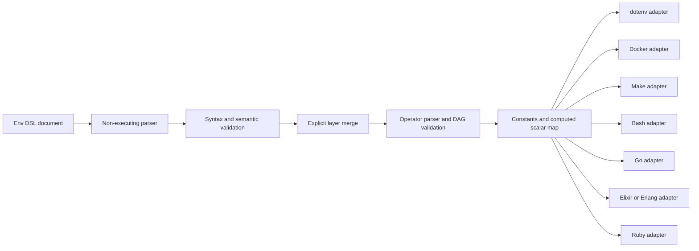

# Env DSL architecture

Env DSL owns one neutral representation: validated constants and suffix-typed
equations keyed by strict `SNAKE_CASE` names. It owns neither process state nor
a host language API.

## Boundary ownership

The standard owns encoding, names, reserved headers, literal-value safety,
duplicate detection, secret rejection, deterministic layer order, operator
precedence, scalar types and effect-free equation evaluation. A target adapter
owns escaping for its destination and conversion to a path, compiled regular
expression or another host-specific value.

An adapter receives the computed map, never source text for a host-language
evaluator. A format that cannot preserve an accepted value directly must use a
generator or API; it must not silently change the value. Ambient environment
variables and implicit profile discovery are outside the merge input.

## Trust model

Env DSL is descriptive and effect-free. A condition cannot authorize a
command, secret lookup or deployment. The checker evaluates only the bounded
Env DSL operator model, has no runtime dependency outside the Python standard
library, invokes no host `eval` and does not compile regular expressions.
