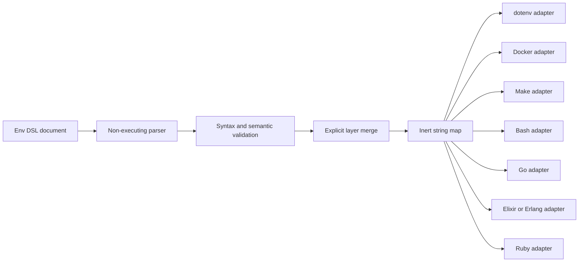

# Env DSL architecture

Env DSL owns one neutral representation: validated strings keyed by strict
`SNAKE_CASE` names. It owns neither process state nor a host language API.

## Boundary ownership

The standard owns encoding, names, reserved headers, literal-value safety,
duplicate detection, secret rejection and deterministic layer order. A target
adapter owns escaping for its destination and any conversion from string to a
number, boolean, path or compiled regular expression.

An adapter receives the parsed map, never source text to evaluate. A format
that cannot preserve an accepted value directly must use a generator or API;
it must not silently change the value. Ambient environment variables and
implicit profile discovery are outside the merge input.

## Trust model

Env DSL is descriptive and effect-free. A document cannot authorize a command,
secret lookup or deployment. The checker is deterministic, has no runtime
dependency outside the Python standard library and does not compile values.
