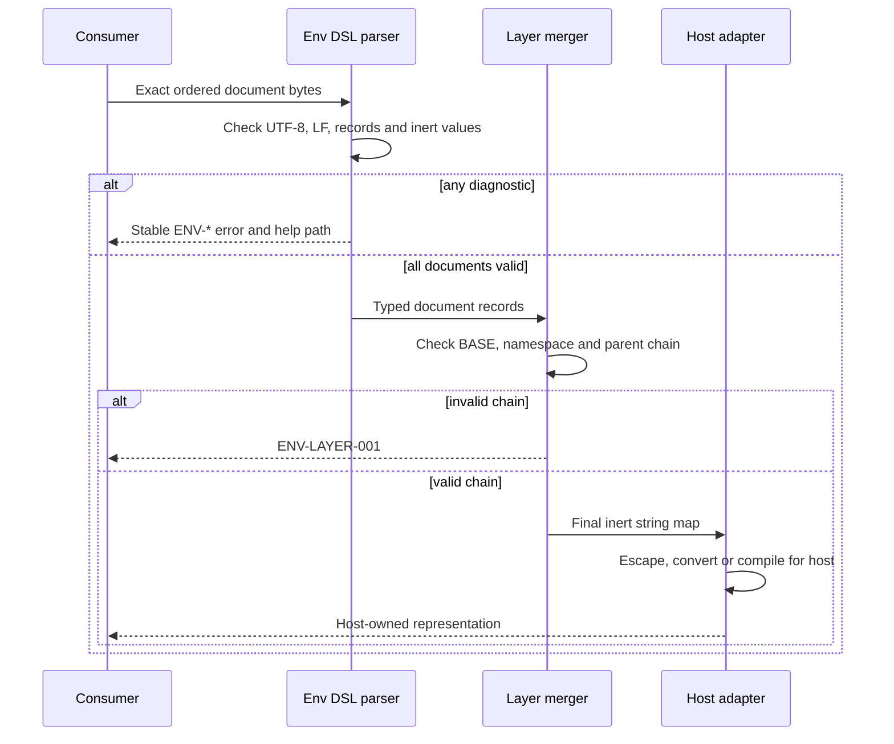

# Env DSL logic flow

Validation completes before layering, and layering completes before a
consumer-specific conversion. No stage evaluates source text.

## Determinism

For one ordered byte sequence, validation and merge output are deterministic.
The merger reads no process environment, clock, network, secret provider or
unnamed file. Later explicit layers replace earlier values with the same name.

## Failure behavior

All errors fail closed. A consumer must not merge a document with syntax,
semantic or security diagnostics. It must not coerce a broken chain into a
plausible order. Diagnostic messages may add context, while each stable code
links to its normative help page.
