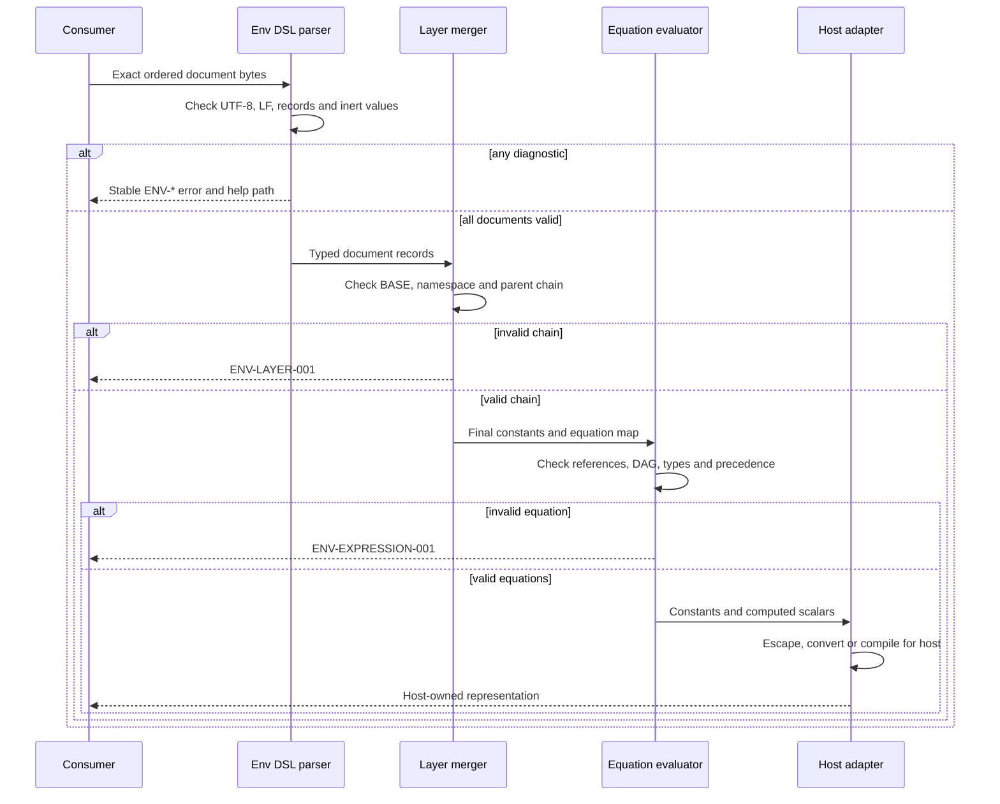

# Env DSL logic flow

Validation completes before layering, and portable equation evaluation
completes before a consumer-specific conversion. No stage invokes a host
expression engine or evaluates source as code.

## Determinism

For one ordered byte sequence, validation and merge output are deterministic.
The merger and equation evaluator read no process environment, clock, network,
secret provider or unnamed file. Later explicit layers replace earlier values
with the same name. References resolve only in the final layered namespace.

## Failure behavior

All errors fail closed. A consumer must not merge a document with syntax,
semantic, expression or security diagnostics. It must not coerce a broken
chain, type mismatch or dependency cycle into a plausible result. Diagnostic
messages may add context, while each stable code links to its normative help
page.
